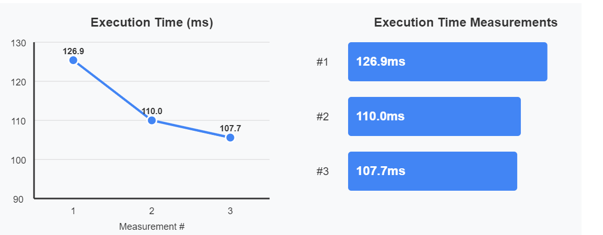

# This is a POC for improving FSharp code  with data oriented software engineering using SOTA models

## Usage
- Insert your anthropic key
- Install the requirements with `pip install -r requirements.txt`
- python main.py <path_to_fsharp_project> <fsharp_file>
- Be ready to go broke and burn your API Credits

There is a sample fsharp_project in the `fsharp_project` folder.

## How does it work
- We take the fsharp project with BenchmarkDotNet
- Run it in Docker and parse BenchmarkDotNet results (execution time only for now)
- Go through improvement checklist and ask the model to propose a change based on that improvement (see improvement list below)
- Make sure that the logic is correct by running an evaluation of input and checking the output
- Run the benchmark again (At the moment if the code fails to compile, we skip the improvement)
- If the improvement is better than the previous one, we keep it and repeat the process

## Results after 10 improvement rounds
The response times show a decreasing trend from 126.9ms → 110.0ms → 107.7ms, indicating improving performance.
I stopped after 10 rounds because I was running out of API credits (cost me 20$).

1,2,3 should be read as 1,4,10

## F# Performance Optimization Checklist

### 📊 Data Structure Selection

#### Collections Performance Hierarchy (Fastest to Slowest)
- [ ] **Arrays** - Use for random access and numerical operations
- [ ] **Dictionary<K,V>** - Use for lookups (15ms/100k ops)
- [ ] **HashSet<T>** - Use for unique item collections
- [ ] **ResizeArray<T>** - Use when size varies significantly
- [ ] **Map<K,V>** - Avoid in hot paths (10x slower than Dictionary)
- [ ] **List<T>** - Avoid for performance-critical code (100x slower for search)

#### Collection Processing
- [ ] Replace `List.map` with `Array.map` in hot paths
- [ ] Use `Array.Parallel` for CPU-intensive operations on large datasets
- [ ] Prefer `Array.filter` over `List.filter` (20% faster after optimizations)
- [ ] Use `Array.partition` for dual filtering (30% less memory)
- [ ] Consider `Seq` for lazy evaluation of large datasets

### 🌿 Branch Prediction Optimization

#### Pattern Matching
- [ ] Order match cases by frequency (most common first)
- [ ] Avoid guards (`when` clauses) in hot paths
- [ ] Replace active patterns with direct matching in performance code
- [ ] Consider lookup tables for complex branching logic

#### Branchless Techniques
- [ ] Convert if/then/else to arithmetic operations where possible
- [ ] Use conditional moves: `condition * trueValue + (1 - condition) * falseValue`
- [ ] Replace min/max conditions with `Math.Min`/`Math.Max`
- [ ] Eliminate null checks with null-safe operators

### 💾 Memory Optimization

#### Struct Usage
- [ ] Convert small records (≤16 bytes) to structs
- [ ] Add `[<Struct>]` attribute to eligible types
- [ ] Include `[<IsReadOnly>]` to prevent defensive copying
- [ ] Verify struct size with `sizeof<'T>`
- [ ] Avoid structs for types with reference fields

#### Memory Pooling
- [ ] Implement `ArrayPool<T>.Shared` for temporary buffers
- [ ] Always return buffers in `finally` blocks
- [ ] Use `MemoryPool<T>` for sliceable memory segments
- [ ] Clear sensitive data before returning to pool

#### Span and Memory
- [ ] Replace array slicing with `Span<T>` (25x improvement)
- [ ] Use `ReadOnlySpan<T>` for immutable views
- [ ] Convert string operations to `ReadOnlySpan<char>`
- [ ] Leverage `stackalloc` for small temporary buffers

#### Allocation Reduction
- [ ] Eliminate intermediate array allocations in pipelines
- [ ] Cache delegate instances to avoid closure allocations
- [ ] Use `ValueOption` instead of `Option` in hot paths
- [ ] Avoid boxing by using concrete types in generic functions

### 🔧 Code-Level Optimizations

#### Loop Optimization
- [ ] Unroll small, fixed-size loops
- [ ] Hoist invariant calculations outside loops
- [ ] Use `for` loops instead of `Seq.iter` for arrays
- [ ] Minimize allocations inside loops

#### String Handling
- [ ] Replace string concatenation with `StringBuilder`
- [ ] Use `String.Create` for known-size strings
- [ ] Cache frequently-used string values
- [ ] Consider interning for repeated string literals

#### Numeric Optimization
- [ ] Use primitive types directly (avoid generic math where possible)
- [ ] Replace `pown` with specific power operations
- [ ] Leverage SIMD operations via `System.Numerics.Vectors`
- [ ] Use bit manipulation for power-of-2 operations

### ⚡ Architecture-Level Optimizations

#### Caching Strategies
- [ ] Implement memoization for pure functions
- [ ] Use `ConcurrentDictionary` for thread-safe caching
- [ ] Apply time-based or size-based cache eviction
- [ ] Consider distributed caching for scale-out scenarios

#### Parallelization
- [ ] Identify embarrassingly parallel operations
- [ ] Use `Array.Parallel` for data parallelism
- [ ] Implement `Async.Parallel` for I/O parallelism
- [ ] Consider TPL Dataflow for pipeline parallelism

#### I/O Optimization
- [ ] Use async/await for all I/O operations
- [ ] Implement buffering for file/network operations
- [ ] Batch database queries
- [ ] Use streaming for large data processing
